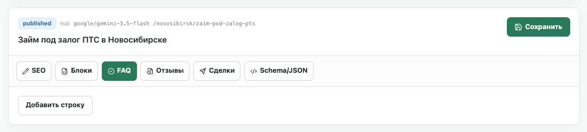
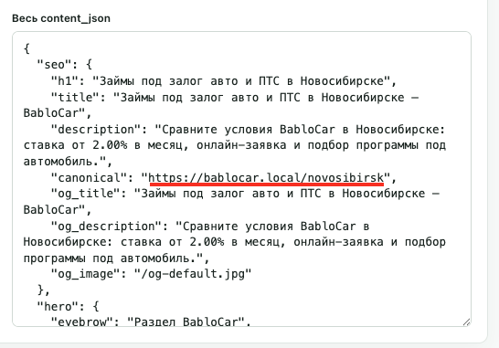
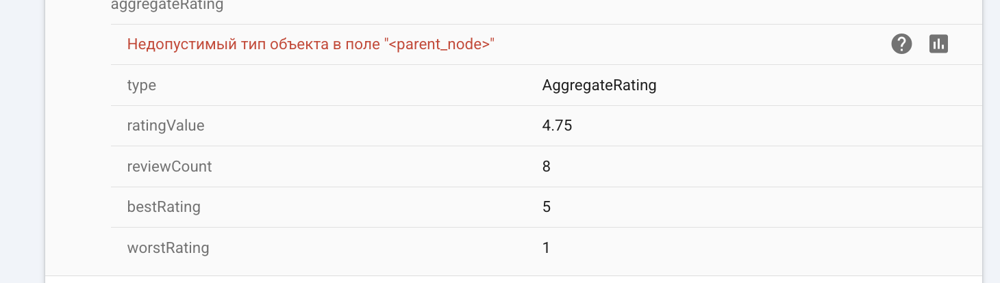
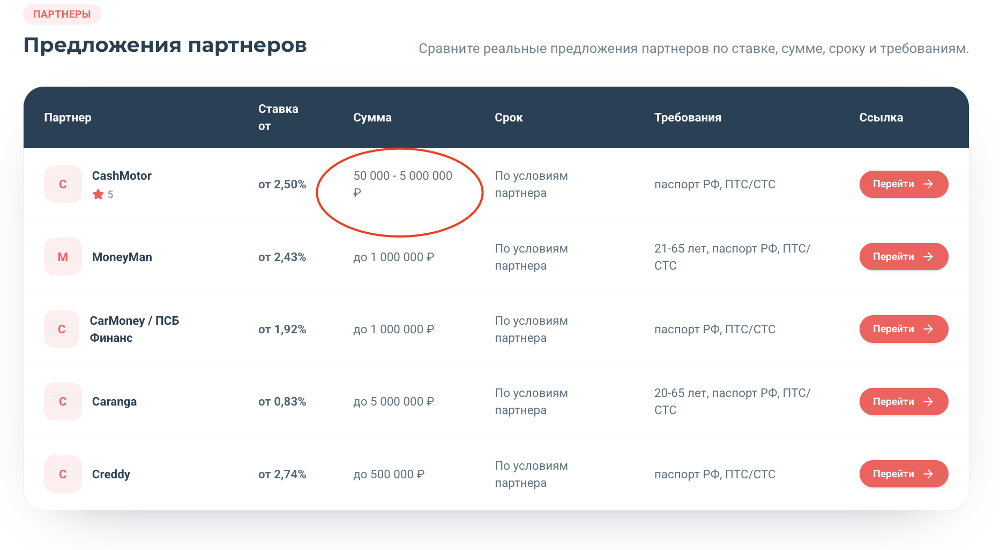

# Доработки админки

## 1. Раздел "Реестр страниц": пустые блоки у хабов

| Пустые блоки в редакторе | Local-ссылка в content_json |
|---|---|
|  |  |

Проблема: у страниц-хабов в настройках блоков нет контента. На сайте страницы есть и визуально выглядят +- нормально, но в редакторе блоки пустые.

Затронутые страницы:

```text
/novosibirsk
/novosibirsk/dengi-pod-zalog-mashiny
/novosibirsk/kredit-pod-zalog-avto
/novosibirsk/zaim-pod-zalog-pts
```

Что видно в админке:
- страница опубликована;
- URL и заголовок есть;
- вкладки `SEO`, `Блоки`, `FAQ`, `Отзывы`, `Сделки`, `Schema/JSON` есть;
- вкладка `SEO` наполнена;
- остальные вкладки с контентными блоками пустые, есть только кнопка `Добавить строку`;
- в `Schema/JSON` есть ошибки форматирования и ссылки на локальный домен;
- контент на боевой странице при этом отображается.

Нужно подтягивать контент всех блоков, кроме сквозных/шаблонных. Шаблонные блоки настраиваются отдельно и затем автоматически подтягиваются на страницы.

## 2. Порядок блоков в JSON и на странице

Пример страницы:

```text
/novosibirsk/kredit-pod-zalog-avto/na-kartu
```

Проблема: в JSON порядок блоков не совпадает с фактическим порядком на странице. Визуально страница выглядит нормально, но похоже, что порядок чинится отдельно при рендеринге через CSS `order-[...]` или другую логику.

Из-за этого непонятно, какой порядок считать основным: порядок в `blocks`, `ui.block_order` или порядок на live-странице. Это может ломать редактор, сохранение блоков и дальнейшую генерацию страниц.

Согласованный порядок блоков:

| № | Городской хаб | Гео-интент | Гео-модификатор |
|---:|---|---|---|
| 0 | Метаданные страницы | Метаданные страницы | Метаданные страницы |
| 1 | Hero / первый экран | Hero / первый экран | Hero / первый экран |
| 2 | Почему выбирают BabloCar | Почему выбирают BabloCar | Почему выбирают BabloCar |
| 3 | Как получить деньги | Как получить деньги | Как получить деньги |
| 4 | Основные направления в городе | Предложения партнеров | Предложения партнеров |
| 5 | Предложения партнеров | Примеры заявок / обращений | Примеры заявок / обращений |
| 6 | Примеры заявок / обращений | Документы и требования | Документы и требования |
| 7 | Документы и требования | Под какой транспорт можно получить деньги | Под какой транспорт можно получить деньги |
| 8 | Под какой транспорт можно получить деньги | Отзывы клиентов | Отзывы клиентов |
| 9 | Отзывы клиентов | Связанные сценарии / модификаторы | Связанные сценарии |
| 10 | Полезный SEO-блок | Полезный SEO-блок | Полезный SEO-блок |
| 11 | FAQ | FAQ | FAQ |
| 12 | Финальный CTA | Финальный CTA | Финальный CTA |

## 3. Пагинация в реестре страниц

Проблема: в разделе `Реестр страниц` сейчас отображается до 50 страниц на экране. Если страниц больше, дальше приходится искать их через фильтры.

Нужна пагинация или другой способ перехода по всем страницам реестра без обязательного поиска через фильтры.

## 4. Промты для генерации отзывов

Проблема: сейчас в отзывы попадает текст промта / служебные параметры, из-за этого отзыв выглядит как техническая заготовка.

Пример текущего плохого вывода:

```text
Оформил займ под залог птс в Новосибирске на Lexus RX. Ставка составила 2.00%. Тональность: нужна крупная сумма.
```

Что не так:
- служебная строка `Тональность` попадает в текст отзыва;
- отзыв выглядит как подстановка переменных, а не как текст клиента;
- ставка выводится как точное условие конкретной сделки;
- `ПТС` должно быть в верхнем регистре;
- нет нормальной клиентской ситуации: зачем обратились, что было важно, чем помог сервис.

## 5. Ошибка в `aggregateRating`

| Ошибка `aggregateRating` |
|---|
|  |

Проблема: валидатор показывает ошибку `Недопустимый тип объекта в поле "<parent_node>"` для `aggregateRating`.

Что видно:
- `aggregateRating` сформирован со значениями `ratingValue`, `reviewCount`, `bestRating`, `worstRating`;
- ошибка относится не к самим числам, а к типу родительского объекта, внутри которого лежит `aggregateRating`;
- текущая JSON-LD разметка из-за этого валидируется с ошибкой.

## 6. Блок "Предложения партнеров": сумма и срок

| Блок "Предложения партнеров" |
|---|
|  |

Проблемы:
- в заголовке колонки `Ставка от` слово `от` переносится на новую строку;
- в колонке `Сумма` знак рубля переносится на новую строку;
- в админке для оффера нет поля `срок`, хотя на странице в таблице есть колонка `Срок`.
- логотипы партнеров нужно залить на наш домен и использовать URL с нашего домена, без прямых ссылок на логотипы с чужих сайтов.
