# Разбор блоков коммерческих лендингов

Сравниваем три типа страниц:

- городской хаб: `/ekb`;
- гео-интент: `/ekb/zaim-pod-zalog-pts`;
- гео-модификатор: `/ekb/zaim-pod-zalog-pts/srochno`.

## Продуктовая база

- [Продуктовый бриф](../product/product_brief.md) - роль Bablocar, условия, калькулятор, документы, транспорт, AI-онбординг и ограничения.
- [Условия партнеров](../partners/partner_conditions.md) - суммы, сроки, ставки, документы, требования и ограничения по обещаниям.
- [Безопасные фразы](../partners/safe_claims.md) - какие формулировки можно использовать, а какие нельзя.

## Что делим и что не делим

| Корзина | Блоки | Что делаем |
|---|---|---|
| Не делим | Метаданные страницы; Hero / первый экран; Почему выбирают Bablocar; Как получить деньги; Варианты от партнеров; Документы и требования; Транспорт; Финальный CTA | Держим единый порядок, дизайн, условия, CTA и логику заявки. Title, H1 и подзаголовок подставляются под URL, но уникальность здесь не разгоняем. Description держим шаблонным. |
| Делим | Примеры заявок / обращений; Отзывы клиентов; Основные направления / связанные сценарии; Полезный SEO-блок; FAQ | Эти блоки отличают страницы по городу, интенту и сценарию: дают текстовую уникальность, живые примеры и правильную внутреннюю перелинковку. |

Почему так: первый экран и фиксированные блоки нужны для ясного оффера, доверия и конверсии. Если менять их случайно, страницы начнут противоречить друг другу по условиям и действию. Уникальность лучше создавать ниже по странице: через реальные сценарии, отзывы, FAQ, SEO-текст и ссылки на связанные страницы.

<br>

---

<br>

## Блок 1. Hero / первый экран

### Скриншоты

| Городской хаб | Гео-интент | Гео-модификатор |
|---|---|---|
|  |  |  |

**SEO-роль:** задает основной интент страницы через H1, условия, калькулятор и CTA. Первый экран подстраивается под URL, но не используется как основной источник уникальности.

### Проблемы

- H1 городского хаба выглядит как интентная страница: `Деньги под залог ПТС в Екатеринбурге`.
- Ключевые условия разные по тексту и расположению.
- На модификаторе указано `до 1 000 000 ₽`, а в согласованных условиях фиксируем `до 5 000 000 ₽`.
- Калькулятор ограничен `1 500 000 ₽`, что конфликтует с согласованными условиями.
- CTA в калькуляторе: `Оформить займ и получить деньги`, а базовый CTA: `Подать заявку`.
- Бейджи над H1 разные, но для них нет правила.

### Решение

- исправить H1 городского хаба;
- привести условия Hero к единому набору;
- привести лимит калькулятора к согласованным условиям;
- CTA в Hero и калькуляторе: `Подать заявку`;
- задать правило для подзаголовка Hero и бейджа.

Целевая логика:

```text
/ekb
Займы и кредиты под залог ПТС и авто в Екатеринбурге

/ekb/zaim-pod-zalog-pts
Займ под залог ПТС в Екатеринбурге

/ekb/zaim-pod-zalog-pts/srochno
Займ под залог ПТС срочно в Екатеринбурге
```

Условия Hero:

```text
До 5 000 000 ₽
До 5 лет
От 2% в месяц
Без изъятия авто
```

Подзаголовок Hero и бейдж разводим только по словарю, без случайной генерации.

Подзаголовок Hero:

- городской хаб - про подбор займов и кредитов под залог транспорта в городе;
- гео-интент - про выбранный продукт в городе;
- гео-модификатор - про выбранный продукт и сценарий клиента.

Бейдж над H1:

- городской хаб - короткий маркер города или региона;
- гео-интент - короткий маркер продукта;
- гео-модификатор - короткий маркер сценария.

<br>

---

<br>

## Блок 2. Почему выбирают Bablocar

### Скриншоты

| Городской хаб | Гео-интент | Гео-модификатор |
|---|---|---|
| 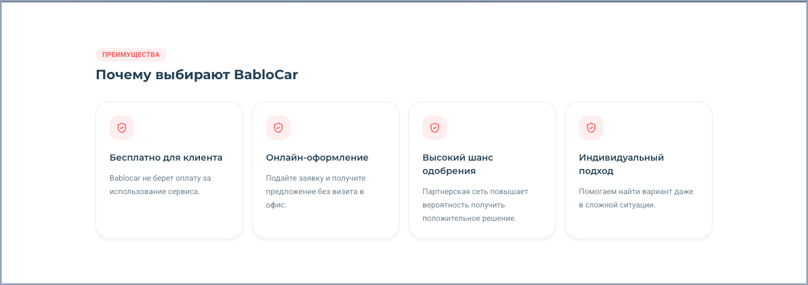 |  |  |

**SEO-роль:** усиливает доверие и объясняет преимущества сервиса. Блок не делим по типам страниц и не используем для SEO-уникальности.

### Проблемы

- На модификаторе другой дизайн блока.
- На модификаторе другой H2 и дополнительные тезисы.
- Этот блок повторяется на всех типах страниц, поэтому разные преимущества могут создавать разные обещания на похожих страницах.

### Решение

- привести дизайн блока к одному виду;
- H2: `Почему выбирают Bablocar`;
- держать одинаковые 4 преимущества на всех типах страниц;
- не добавлять преимущества под город, интент или модификатор, если их нет в продуктовых условиях Bablocar.

Базовые преимущества:

```text
Бесплатно для клиента
Bablocar не берет оплату за использование сервиса.

Онлайн-оформление
Подайте заявку и получите предложение без визита в офис.

Выше шанс одобрения
Партнерская сеть повышает вероятность получить положительное решение.

Индивидуальный подход
Помогаем найти вариант даже в сложной ситуации.
```

<br>

---

<br>

## Блок 3. Как получить деньги

### Скриншоты

| Городской хаб | Гео-интент | Гео-модификатор |
|---|---|---|
| 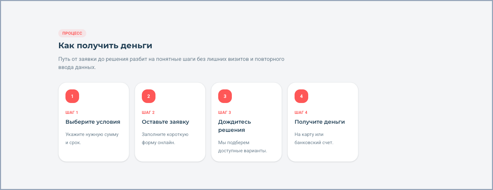 |  |  |

**SEO-роль:** закрывает пользовательский вопрос “как получить / оформить”. Блок объясняет процесс и не используется для SEO-уникальности.

### Проблемы

- На модификаторе другой дизайн процесса.
- H2 на модификаторе: `Деньги по ПТС за пять простых шагов`.
- В блок добавлены лишние обещания: `до 15 минут`, личный кабинет и другие детали.

### Решение

- привести дизайн блока к одному виду;
- H2: `Как получить деньги`;
- `деньги` оставляем как общий вариант для займов, кредитов и денежных сценариев;
- держать одинаковые 4 шага на всех типах страниц;
- выровнять карточки шагов по ширине: на десктопе 4 одинаковые карточки в ряд, на мобильном карточка занимает ширину контейнера;
- убрать лишние обещания из блока процесса.

Шаги:

```text
Выберите условия
Укажите нужную сумму и срок.

Оставьте заявку
Заполните короткую форму онлайн.

Дождитесь решения
Мы подберем доступные варианты.

Получите деньги
На карту или банковский счет.
```

<br>

---

<br>

## Блок 4. Варианты от партнеров

### Скриншоты

| Городской хаб | Гео-интент | Гео-модификатор |
|---|---|---|
| 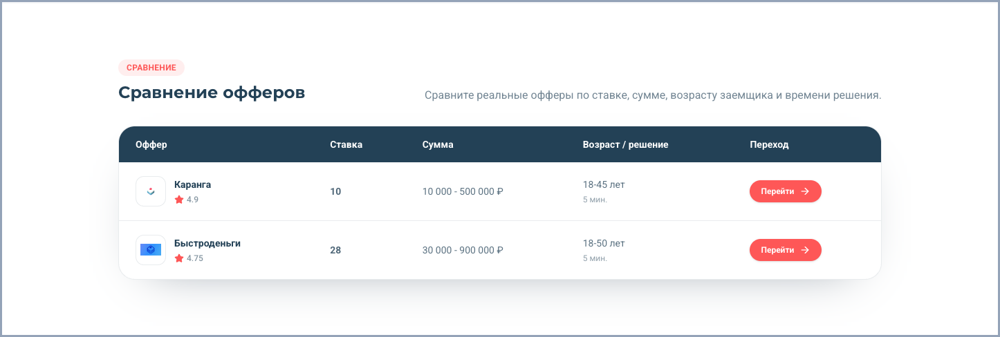 |  |  |

**SEO-роль:** показывает, что Bablocar подбирает варианты, а не ведет к одному фиксированному займу. Блок не используем как главный источник SEO-уникальности.

### Проблемы

- Проверяем не условия в таблице, а сам блок: H2, таблицу и CTA.
- Данные вариантов временные, их разберем отдельно.

### Решение

- H2: `Варианты от партнеров`;
- таблица вариантов выглядит одинаково на всех типах страниц;
- CTA: `Подать заявку`;
- данные вариантов дорабатываем позже.

<br>

---

<br>

## Блок 5. Примеры заявок / обращений

### Скриншоты

| Городской хаб | Гео-интент | Гео-модификатор |
|---|---|---|
| 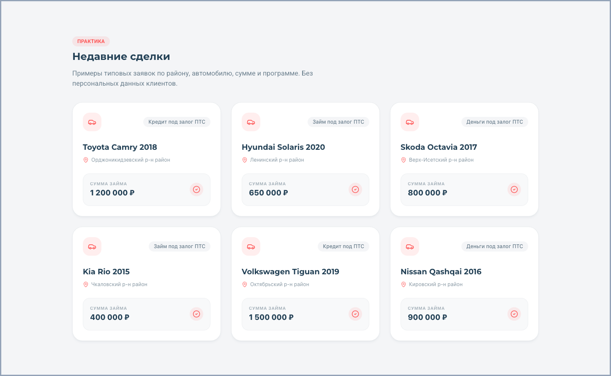 | 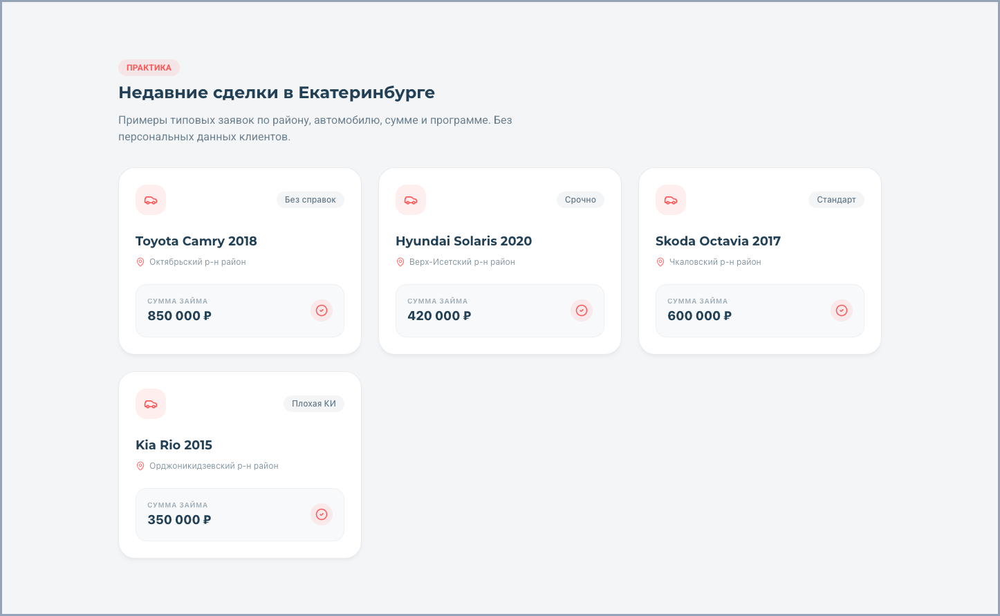 | 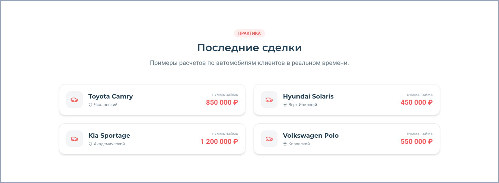 |

**SEO-роль:** добавляет локальные и сценарные доказательства. Для уникальности полезен, если заявки реально отличаются по авто, сумме, сроку и ситуации.

### Проблемы

- Это блок для уникальности страницы, но текущие карточки частично повторяются.
- На городском хабе и гео-интенте повторяются одни и те же автомобили: Toyota Camry 2018, Hyundai Solaris 2020, Skoda Octavia 2017, Kia Rio 2015.
- Количество карточек отличается: на городском хабе 6, на гео-интенте 4, на гео-модификаторе 4.
- На гео-модификаторе другой дизайн карточек и другая сетка.
- Названия блока отличаются без правила: `Недавние сделки`, `Недавние сделки в Екатеринбурге`, `Последние сделки`.

### Решение

- использовать блок для уникальности страницы, но не менять его дизайн от страницы к странице;
- задать единое количество: 4 карточки на всех типах страниц;
- привести дизайн карточек к одному виду;
- не повторять один и тот же набор автомобилей между городом, интентом и модификатором;
- карточки должны отличаться по автомобилю, сумме, району, сценарию и тегу;
- H2 привести к одному правилу.

Правило H2:

```text
Городской хаб: Недавние заявки в {городе}
Гео-интент: Недавние заявки: {интент} в {городе}
Гео-модификатор: Недавние заявки: {интент} {модификатор} в {городе}
```

Поля карточки:

```text
Автомобиль
Район или город
Сумма
Сценарий или тег
```

<br>

---

<br>

## Блок 6. Документы и требования

### Скриншоты

| Городской хаб | Гео-интент | Гео-модификатор |
|---|---|---|
|  | 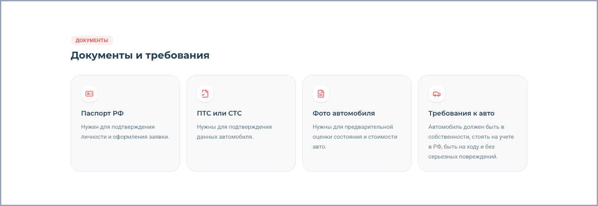 | 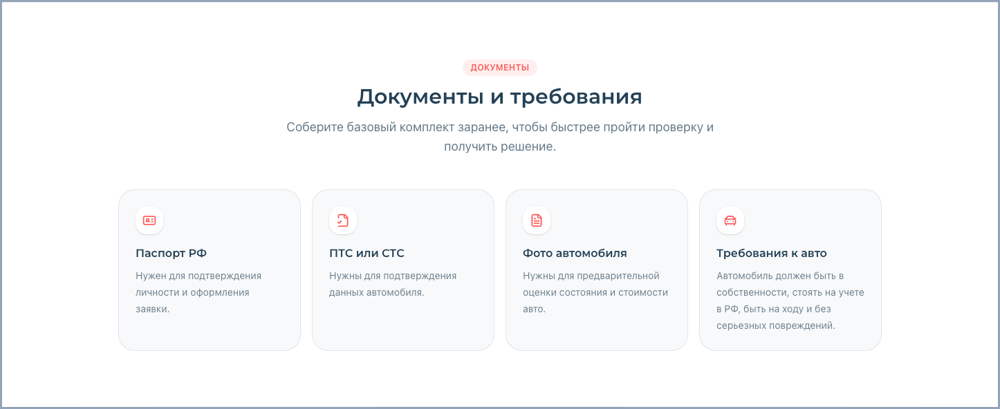 |

**SEO-роль:** закрывает спрос про документы и требования. Блок должен быть стабильным, чтобы не создавать противоречия между страницами.

### Проблемы

- На городском хабе и гео-интенте блок совпадает.
- На гео-модификаторе тот же набор карточек, но другая заголовочная зона: центрирование и дополнительная подводка.
- Для сквозного блока это лишнее отличие.

### Решение

- H2: `Документы и требования`;
- без уникальной подводки под тип страницы;
- 4 карточки одинаковые на всех типах страниц;
- дизайн карточек и заголовочной зоны одинаковый.

Карточки:

```text
Паспорт РФ
ПТС или СТС
Фото автомобиля
Требования к авто
```

<br>

---

<br>

## Блок 7. Транспорт

### Скриншоты

| Городской хаб | Гео-интент | Гео-модификатор |
|---|---|---|
|  | 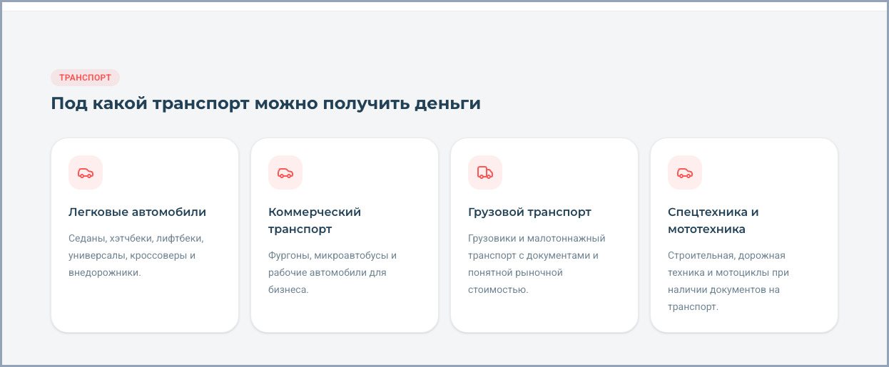 |  |

**SEO-роль:** закрывает спрос по типам транспорта и усиливает продуктовую понятность. Блок сквозной, поэтому не используем его для SEO-уникальности.

### Проблемы

- На городском хабе и гео-интенте блок совпадает.
- На гео-модификаторе другой H2, бейдж, подводка, иконки и общий ритм.
- Формулировка `для любых ТС` звучит шире, чем нужно для сквозного блока.

### Решение

- H2: `Под какой транспорт можно получить деньги`;
- без уникальной подводки под тип страницы;
- 4 карточки одинаковые на всех типах страниц;
- дизайн карточек, иконки и заголовочная зона одинаковые;
- не использовать `любые ТС` как универсальное обещание.

Карточки:

```text
Легковые автомобили
Коммерческий транспорт
Грузовой транспорт
Спецтехника и мототехника
```

<br>

---

<br>

## Блок 8. Основные направления / связанные сценарии

### Скриншоты

| Городской хаб | Гео-интент | Гео-модификатор |
|---|---|---|
| 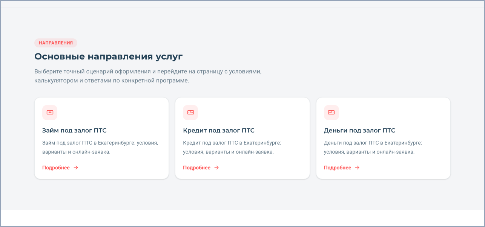 | 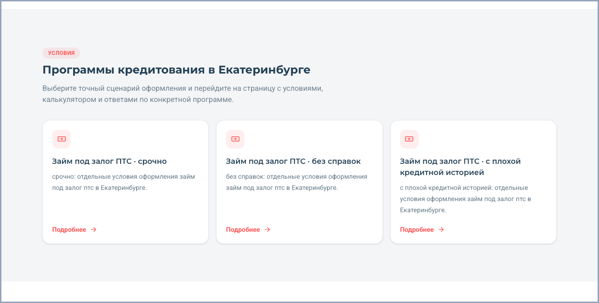 | 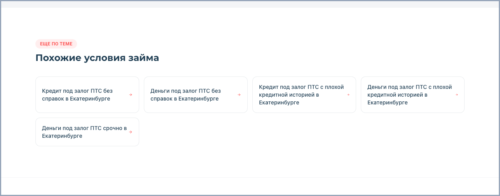 |

**SEO-роль:** передает вес и смысл внутри дерева сайта. Уникальность здесь создается не случайным текстом, а разными ссылками под роль страницы.

### Проблемы

- На городском хабе логика правильная: блок ведет в основные интенты города.
- На гео-интенте логика правильная: блок ведет в модификаторы текущего интента, но H2 `Программы кредитования в Екатеринбурге` не подходит для страницы займа.
- На гео-модификаторе нет ссылки на родительскую страницу.
- На гео-модификаторе ссылки ведут в другие интенты: кредит под ПТС и деньги под ПТС, а должны вести в родителя и соседние модификаторы текущего интента.

### Решение

Правило ссылок:

```text
Городской хаб -> гео-интенты города
Гео-интент -> модификаторы этого интента в городе
Гео-модификатор -> родительская гео-интентная страница + соседние модификаторы этого же интента
```

Пример для `/ekb/zaim-pod-zalog-pts/srochno`:

```text
/ekb/zaim-pod-zalog-pts/
/ekb/zaim-pod-zalog-pts/bez-spravok/
/ekb/zaim-pod-zalog-pts/s-plohoi-ki/
/ekb/zaim-pod-zalog-pts/bez-izyatiya/
```

Правило H2:

```text
Городской хаб: Основные направления в {городе}
Гео-интент: Связанные сценарии
Гео-модификатор: Похожие условия
```

Интент и модификатор раскрываем в анкорах карточек.

<br>

---

<br>

## Блок 9. Отзывы клиентов

### Скриншоты

| Городской хаб | Гео-интент | Гео-модификатор |
|---|---|---|
| 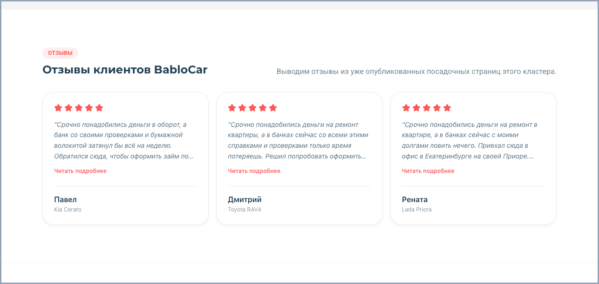 | 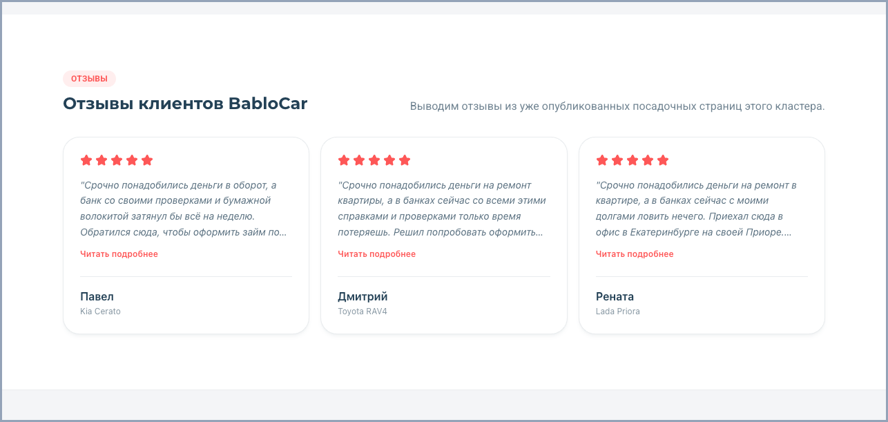 |  |

**SEO-роль:** добавляет доверие и живые сценарии. Это блок для уникальности, если отзывы отличаются по ситуации, автомобилю, городу и первой фразе.

### Проблемы

- Городской хаб и гео-интент используют один и тот же набор отзывов: Павел / Kia Cerato, Дмитрий / Toyota RAV4, Рената / Lada Priora.
- Гео-модификатор использует те же отзывы, только в другом порядке.
- Повторяется старт отзывов: `Срочно понадобились деньги...`.
- Подводка `Выводим отзывы из уже опубликованных посадочных страниц этого кластера` выглядит как внутренняя заметка, а не текст для пользователя.
- H2 отличается без правила: `Отзывы клиентов BabloCar` и `Что говорят клиенты`.

### Решение

- H2: `Отзывы клиентов BabloCar`;
- подводка уникальная под тип страницы, но без служебного текста;
- в карусели 6-8 отзывов, на десктопе видно 3 карточки;
- не повторять один и тот же набор отзывов между городом, интентом и модификатором;
- внутри одной страницы не начинать отзывы одинаковой фразой;
- разводить отзывы по причине обращения, автомобилю и ситуации клиента.

Примеры подводки:

```text
Городской хаб: Истории клиентов из {города}, которые оставляли заявку через Bablocar.
Гео-интент: Отзывы клиентов, которые оформляли {интент} в {городе}.
Гео-модификатор: Отзывы клиентов с похожим сценарием: {интент} {модификатор}.
```

Причины для разведения отзывов:

```text
деньги на ремонт
деньги для бизнеса
плохая кредитная история
без справок о доходах
срочное обращение
рефинансирование
авто осталось у клиента
```

<br>

---

<br>

## Блок 10. Полезный SEO-блок

### Скриншоты

| Городской хаб | Гео-интент | Гео-модификатор |
|---|---|---|
| 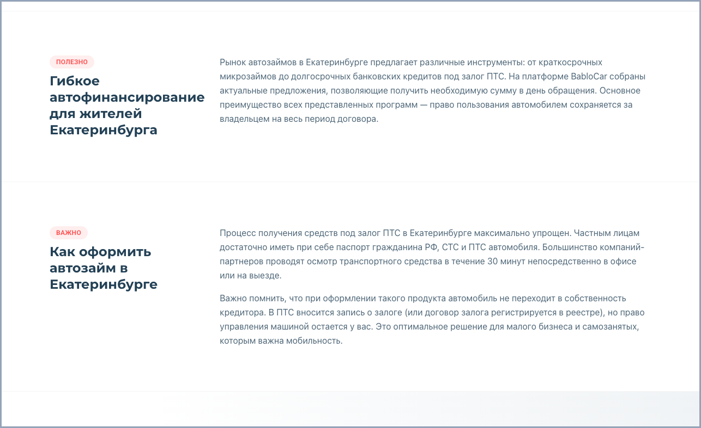 | 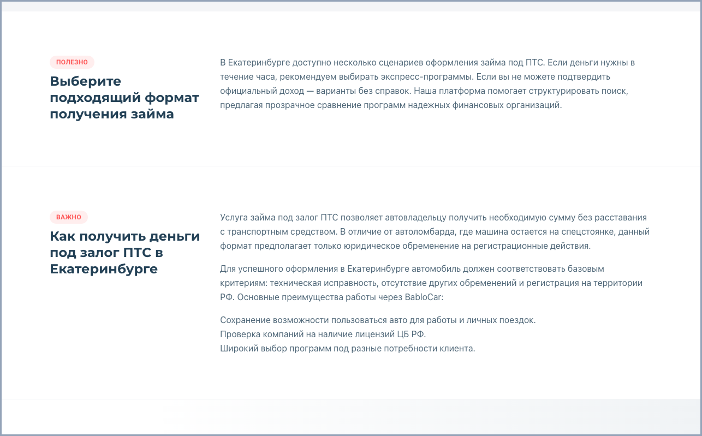 | 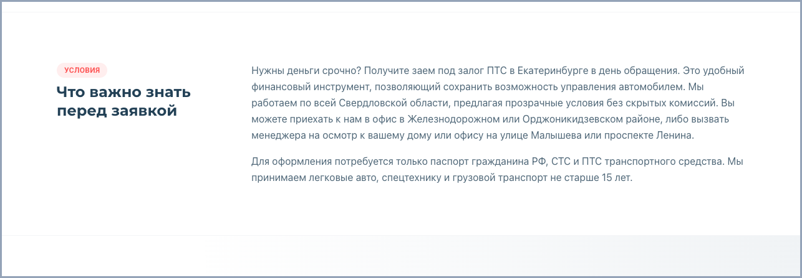 |

**SEO-роль:** главный текстовый блок для семантической уникальности. Здесь раскрываем город, интент, модификатор и алиасы без изменения условий.

### Проблемы

- Сейчас разное количество секций без правила: город и гео-интент - 2 секции, модификатор - 1 секция.
- В тексте встречаются лишние обещания и детали: `в течение часа`, `в день обращения`, офисы, выезд менеджера, возраст транспорта, проверка лицензий ЦБ РФ.
- Нет единой логики, что раскрывает первый, второй и третий абзац.

### Решение

- делать 1 текстовый блок из 3 коротких абзацев;
- не добавлять новые условия, сроки рассмотрения, офисы, выезды, лицензии и требования, которых нет в продуктовой базе;
- каждый абзац отвечает за свою задачу.

Логика 3 абзацев:

```text
Абзац 1 - что это за страница и какой спрос она закрывает.
Абзац 2 - как Bablocar помогает в этом сценарии.
Абзац 3 - что важно знать перед заявкой и к какому действию подводим.
```

Городской хаб:

```text
1. Раскрываем город и общий спрос: подбор займов и кредитов под залог ПТС и авто в {городе}.
2. Показываем, что внутри города доступны разные направления: займ, кредит и деньги под залог ПТС или авто.
3. Подводим к выбору направления или заявке: сумма, срок, документы, авто остается у клиента.
```

Гео-интент:

```text
1. Раскрываем конкретный интент в городе: {интент} в {городе}.
2. Объясняем механику через Bablocar: расчет суммы и срока, заявка онлайн, подбор доступных вариантов.
3. Закрываем базовые вопросы по интенту: документы, автомобиль, решение, получение денег.
```

Гео-модификатор:

```text
1. Раскрываем конкретный сценарий: {интент} {модификатор} в {городе}.
2. Объясняем, как учитывается ситуация клиента: кредитная история, справки, срочность, просрочки или другой модификатор.
3. Подводим к заявке без гарантированных обещаний: Bablocar помогает подобрать доступные варианты по данным клиента и автомобиля.
```

<br>

---

<br>

## Блок 11. FAQ

### Скриншоты

| Городской хаб | Гео-интент | Гео-модификатор |
|---|---|---|
|  |  |  |

**SEO-роль:** покрывает хвостовые вопросы, возражения и модификаторы. Это один из безопасных блоков для управляемой уникальности.

### Проблемы

- Вопросов мало: на городском хабе и гео-интенте 4, на гео-модификаторе 3.
- H2 отличается без причины: `Частые вопросы` / `Часто задаваемые вопросы`.
- Городской хаб и гео-интент частично повторяют один и тот же набор вопросов.
- На гео-модификаторе вопросы слабо раскрывают сам модификатор `срочно`.
- В ответах нельзя добавлять механику и обещания, которых нет в продуктовой базе.

### Решение

- H2: `Частые вопросы`;
- 5-7 вопросов на странице;
- ответы короткие: 2-4 предложения;
- вопросы и ответы пишем под тип страницы, а не копируем один набор на все URL;
- 2-3 базовые темы могут повторяться, но формулировка должна попадать в город, интент или модификатор.

Логика FAQ по типам страниц:

```text
Городской хаб
Вопросы про подбор займов и кредитов в городе: какие направления доступны, как подать заявку онлайн, какие документы нужны, остается ли авто у клиента, как выбирается сумма и срок, как получить деньги.

Гео-интент
Вопросы про конкретный продукт в городе: как получить {интент}, какие условия доступны, какие документы нужны, влияет ли кредитная история, остается ли авто у клиента, как проходит рассмотрение, как получить деньги.

Гео-модификатор
Вопросы про конкретную ситуацию клиента: можно ли оформить {интент} {модификатор}, что учитывается при таком сценарии, какие документы нужны, остается ли авто у клиента, как подать заявку онлайн, как Bablocar подбирает варианты.
```

Примеры для `/ekb/zaim-pod-zalog-pts/srochno`:

```text
Можно ли получить займ под залог ПТС срочно в Екатеринбурге?
Что влияет на скорость рассмотрения заявки?
Какие документы нужны для срочной заявки?
Останется ли автомобиль у меня?
Можно ли подать заявку онлайн?
Как Bablocar подбирает доступные варианты?
```

<br>

---

<br>

## Блок 12. Финальный CTA

### Скриншоты

| Городской хаб | Гео-интент | Гео-модификатор |
|---|---|---|
|  |  |  |

**SEO-роль:** почти не дает уникальности, зато важен для конверсии. Действие и условия должны быть одинаковыми на всех страницах.

### Проблемы

- На городском хабе и гео-интенте блок совпадает, но кнопка `Рассчитать займ` не совпадает с базовым CTA.
- На гео-модификаторе другой бейдж: `Гарантия Bablocar`.
- На гео-модификаторе другой текст правой карточки: `Рассчитайте займ и получите предложение`.
- Кнопки отличаются: `Рассчитать займ` / `Рассчитать и оформить`.
- На гео-модификаторе есть лишний текст про личный кабинет.
- Финальный CTA не используем для уникальности, поэтому текст и действие должны быть одинаковыми.

### Решение

- H2: `Оставьте заявку онлайн`;
- описание: `Укажите сумму и срок, а Bablocar поможет подобрать доступные варианты.`;
- условия: `До 5 000 000 ₽`, `До 5 лет`, `Авто остается у вас`;
- правая карточка: `Готовы начать?` / `Подайте заявку онлайн`;
- кнопка: `Подать заявку`;
- бейдж, описание, условия, правая карточка и кнопка одинаковые на всех типах страниц;
- убрать тексты про расчет займа, оформление, личный кабинет и форму в первом экране.

Финальный состав:

```text
Бейдж: Bablocar
H2: Оставьте заявку онлайн
Описание: Укажите сумму и срок, а Bablocar поможет подобрать доступные варианты.
Условия:
- До 5 000 000 ₽
- До 5 лет
- Авто остается у вас
Правая карточка:
- Готовы начать?
- Подайте заявку онлайн
- Подать заявку
```
